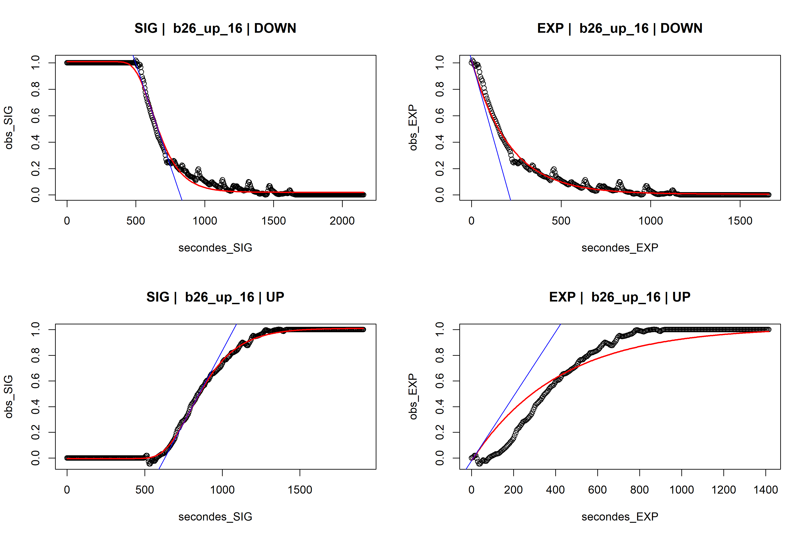

# Fitting dynamic parameters of photosynthesis and stomatal conductance

## DYNAMOG & DYNAMOP
`DYNAMOG` is the original, and calculate time constant of exponential and sigmoidal model of stomatal opening and closure. 
`DYNAMOP` is for photosynthesis, handles differently decrease in irradaince (compute dynamic of photosynthetic recovery instead).  

_Arguments:_  
- **df** [default = df]: Origin data frame with gas excahnge data.  
- **id** [default = NULL]: Identifier for each replicate curve.  
- **norm** [default = FALSE]: If true, normalize data between 0 and 1.  
- **timestep** [default = 30]: Timestep between measurements, in seconds.  
- **PltLength** [default = 100]: Extend plateau at start and end.  
- **ITER** [default = 100]: Number of iterations for opitimasion routine. Increase if very noisy curve.  
- **relPlt** [default = NULL]: Instead of giving a fixed number of points, extend by percent of curve length.    
- **plotall** [default = TRUE]: If true, plot the fits.  
- **savePlot** [default = FALSE]: If true, print the plot as picture.

